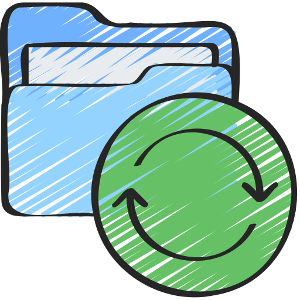

</img>
# Disk synchronization tool 
Syncing files accross directories and devices.

## Usage
```sh
dsync version v1.2.0 -- syncing files accross directories and devices.
-s       --src Required: Source directory.
-d       --dst Required: Destination directory.
-m    --method           Synchronization method. (default: update)
-i --ignore_df           Ignore dot files. (default: false)
-v   --verbose           Verbose level [0 - off, 1 - brief, 2 - detailed]. (default: 1)
-h      --help           This help information.
OPTIONS:
    --method=target Make the destination folder exactly like the source.
                    Extra files in the destination will be deleted.
    --method=update Copy new and update changed files from source to destination.
                    Does not delete any files from destination.
    --method=dual   Keep both folders in sync. New and changed files are copied both ways.
                    No files are deleted.
EXAMPLE:
    dsync --src ~/disk1 --dst ~/disk2 --method=update --verbose 2
```

## Build

### From Source
You’ll need the [D compiler](https://dlang.org/) (`dmd` or `ldc2`).

**NOTE:** Use `ldc2` if you are on mac.

```sh
$ git clone https://github.com/rillki/dsync.git
$ cd dsync && dub build --build=release
```
The compiled binary will be saved to the `bin` directory.

## LICENSE
All code is licensed under the MIT license.

